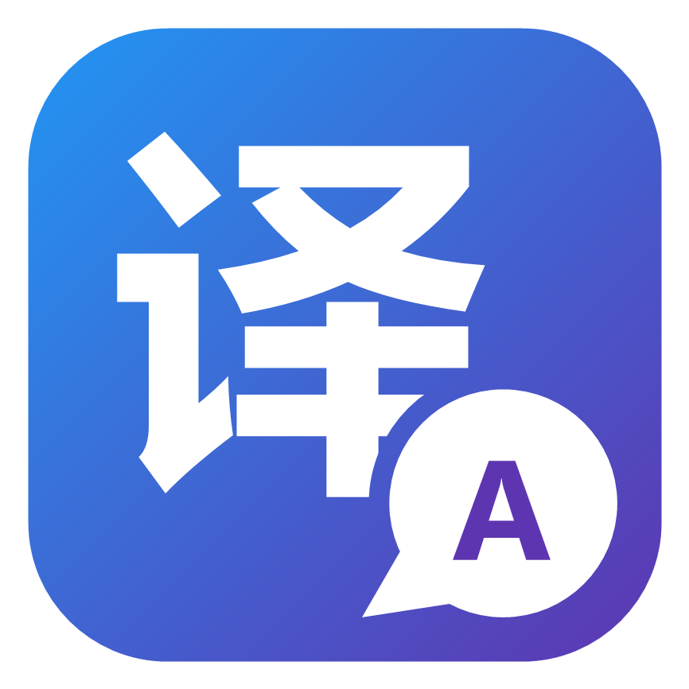
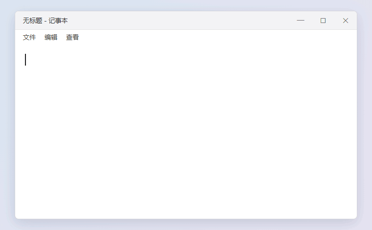

<p align="center">
  
</p>

<h1 align="center">译句输入法 YiJu</h1>

<p align="center"><strong>打完一句中文，整句英文翻译就出来了。</strong><br>
Type a sentence in Chinese — get the whole sentence in English, right under your candidates.</p>

<p align="center">
  <a href="LICENSE"></a>
  
  
  
</p>

<p align="center">💬 用着怎么样？欢迎到 <a href="https://github.com/501428005a-sys/yiju-ime/discussions">讨论区</a> 聊使用感受、提建议</p>

<p align="center">
  <br>
  <sub>示意动画，按译句候选窗的实际样式与触发节奏制作（<a href="assets/demo/">assets/demo</a>）</sub>
</p>

---

## 为什么做译句

大多数「学英语输入法」只能告诉你**一个词**怎么说。可真正想知道的，往往是**这一整句话**用英文怎么讲。

译句做的就是这件事：照常用拼音打字，**一句话打完，整句的英文翻译自动出现在候选窗口下方**。不用复制、不用切软件、不打断输入。

```text
jintiantianqihenhao␣         ← 照常打字、上屏
                              ← 停顿 1 秒
 1 今天天气很好
 …
 译 The weather is really nice today.
```

## 整句翻译怎么用

- **自动触发**，三种情况任一即可：
  - 上屏后**停顿 1 秒**没再按键；
  - 打出句末标点 `。` `？` `！`；
  - 在聊天框里按**回车**发送。
- 触发后立刻出现一行「**译 翻译中…**」，译文一回来就原地替换。
- **一段一行**：连着打几段，每段的译文各占一行、按打字顺序排列，每行缺省停留 20 秒（Windows「设置 → 云服务 → 整句译文停留秒数」、macOS 偏好设置「云服务 → 整句译文停留」可改）。
- **不打断输入**：继续打字时，译文行留在候选列表下面，不参与选词、不会被误选，也不会自动上屏。
- 默认译成英文；在设置里把学习语言换成日语 / 西班牙语，就译成对应语言。
- 密码框里不翻译；少于两个汉字的片段不翻译。

整句翻译使用你自己在「设置 → 云服务」里填写的 AI 服务（缺省 DeepSeek，任何 OpenAI 兼容接口都可以）。请求从你的电脑**直接**发往服务商，不经过任何第三方服务器。

## 其他功能

译句派生自开源输入法[青简](https://github.com/qingjian-team/qingjian)，以下能力都完整保留：

- 候选词旁显示单词译文与词性，`Ctrl + 数字` 直接上屏译文；
- 选中任意文字按快捷键翻译（Windows `Ctrl + Alt + T`，macOS 在偏好设置「快捷键」里看）；
- 整句拼音输入、简拼、拼写纠错、本地整句模型重排；
- 全拼 / 七种双拼 / 五笔 / 注音；模糊音；领域词库；
- 云联想：云端候选词、整句补全（`Tab` 接受）、问字；
- 学习你的用词习惯，全部数据只存在本机。

## 现状

- 当前版本基于青简 0.1.4，支持 **Windows 11**（64 位）和 **macOS**（Apple Silicon / Intel）。Windows 10 的支持在做。

## 安装

### Windows

1. 到 [Releases](https://github.com/501428005a-sys/yiju-ime/releases) 下载 `yiju-<版本>-windows-x86_64-setup.exe`，双击安装（需要管理员权限）。
2. 安装包还没有代码签名，Windows SmartScreen 会拦截：点「更多信息 → 仍要运行」。
3. 装好后按 `Win + Space` 切到「译句」；建议注销重新登录一次，让所有程序都用上。
4. 按下面「配置云服务」填好 AI 密钥，整句翻译就能用了。

- 如果电脑上装着**青简**，安装程序会先提示卸载它（两者不能同时安装）；青简的配置、密钥与学习数据会保留，译句直接接着用。
- 卸载：「设置 → 应用」里找到「译句」卸载即可，配置与学习数据保留在 `%APPDATA%\Qingjian`。

### macOS

1. 到 [Releases](https://github.com/501428005a-sys/yiju-ime/releases) 下载对应芯片的安装包：Apple Silicon（M 系列）用 `yiju-<版本>-macos-arm64.pkg`，Intel 用 `yiju-<版本>-macos-x86_64.pkg`。
2. 安装包没有经过 Apple 公证，第一次双击会提示「无法验证开发者」：到「系统设置 → 隐私与安全性」，在页面下方点「仍要打开」，再按提示安装（需要管理员密码）。
3. 装好后「译句」会自动加进输入法列表，点菜单栏的输入法图标切过去即可；列表里没有就注销再登录一次。
4. 在输入法菜单里打开「偏好设置 → 云服务」，按下面「配置云服务」填好 AI 密钥。

- 译句与青简共用同一个输入法标识，装了青简的 Mac 上会被译句替换，配置与学习数据保留在 `~/Library/Application Support/Qingjian/`。
- 卸载：`/Library/Input\ Methods/Qingjian.app/Contents/Resources/uninstall.sh`（加 `--purge` 连配置与学习数据一起删）。

## 配置云服务

1. 打开「设置 → 云服务」，打开云联想开关；
2. 填写服务地址、模型与 API 密钥（DeepSeek 在其开放平台申请密钥）；
3. 点「测试连接」，成功后整句翻译与云联想即可使用。

密钥只保存在本机（Windows 在 `%APPDATA%\Qingjian\.env`，macOS 在 `~/Library/Application Support/Qingjian/.env`），不会写进配置文件导出，也不会出现在日志里。

## 从源码编译（Windows）

官方工具链（MSVC）与上游一致，见 [apps/windows/README.md](apps/windows/README.md)。不想装 Visual Studio 时也可以用 Rust 的 GNU 工具链
（打安装包：`apps\windows\installer\build.ps1 -Gnu`，需要 MinGW-w64 的 64 / 32 位版、`i686-pc-windows-gnu` 目标与 Inno Setup 7；GNU 版设置程序只能在 Windows 11 上运行）：

```powershell
rustup toolchain install 1.96.0-x86_64-pc-windows-gnu   # 另需 MinGW-w64（如 winlibs）在 PATH 中
$env:QINGJIAN_UIACCESS = '0'                             # 没有代码签名证书时关掉 uiAccess
cargo build --release -p qingjian-windows-server
cargo test  --release -p qingjian-windows-server
```

## 从源码编译（macOS）

```bash
tools/release/data-fetch.sh             # 下载青简的词库与语言模型（按 tools/release/data.lock 校验）
apps/macos/scripts/bundle.sh --install  # 装到 ~/Library/Input Methods/ 自用
apps/macos/scripts/bundle.sh --pkg      # 打安装包 target/pkg/yiju-<版本>-macos-<架构>.pkg
```

签名、公证与 Intel 交叉编译见 [apps/macos/README.md](apps/macos/README.md)。

整句翻译的实现：Windows 在 [`apps/windows/server/src/dispatch/echo/`](apps/windows/server/src/dispatch/echo/mod.rs)，macOS 在 [`apps/macos/src/host/echo/`](apps/macos/src/host/echo/mod.rs)，设计说明见 [AGENTS.md](AGENTS.md)。

## 来源与致谢

译句派生自 [青简 Qingjian](https://github.com/qingjian-team/qingjian)（GPL-3.0-or-later）。输入引擎、平台壳、数据与工具链均来自该项目，感谢原作者与贡献者。原有版权声明全部保留；本仓库的改动同样以 GPL-3.0-or-later 发布，改动说明见 [NOTICE](NOTICE)。

随包数据（词库、语言模型、释义表、emoji、英文词表、词汇等级、码表）各自遵循来源的许可证，清单见 [docs/design/landscape.md](docs/design/landscape.md)。

## 许可与品牌

- 代码以 **GPL-3.0-or-later** 发布（见 [LICENSE](LICENSE)）：可以自由使用、修改与再分发，**修改后分发须同样以 GPL 开源全部源码**。
- **「译句」名称与 logo 不在授权范围内。** 基于本项目发布的修改版请使用其他名称与图标，并注明来源。
- 译句永久免费。若你为获得它向他人付费，你被骗了。
